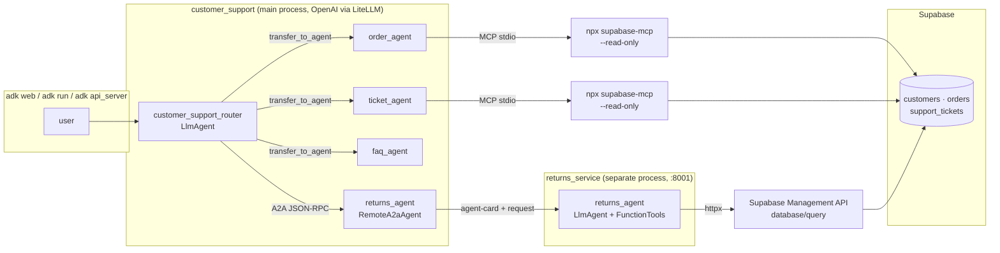

<div align="center">

# Multi-Agent Customer Support System

**Route, reason, resolve.** A **Google ADK** router delegates to **MCP-connected** specialists for orders and tickets, and hands returns off to a separate **A2A** service — all grounded in a live **Supabase** store.

[](https://www.python.org/)
[](https://google.github.io/adk-docs/)
[](https://google.github.io/adk-docs/a2a/)
[](https://supabase.com/docs/guides/getting-started/mcp)
[](https://docs.litellm.ai/)
[](https://openai.com/)
[](https://www.starlette.io/)

</div>

</div>

## At a glance

| | |
|:---|:---|
| **Router** | `customer_support_router` — `LlmAgent` that classifies intent and `transfer_to_agent` to exactly one specialist. |
| **Orders** | `order_agent` — order / shipping / tracking. **Read-only Supabase via MCP** (`npx @supabase/mcp-server-supabase`). |
| **Tickets** | `ticket_agent` — existing tickets + triage of new complaints. **Read-only Supabase via MCP**. |
| **Returns** | `returns_agent` — **`RemoteA2aAgent`** pointing at a standalone service that can **write** (refund ticket + flip `orders.status='returned'`). |
| **FAQ** | `faq_agent` — shipping / returns / warranty policy text. **No database**. |
| **Data** | Supabase with `customers`, `orders`, `support_tickets` (15 seeded rows each; see `Backend/database/`). |
| **Protocols** | **MCP** over stdio for read path; **A2A** over HTTP/JSON-RPC for the remote Returns specialist. |

---

## Feature highlights

```
┌──────────────────────────────────────────────────────────────────┐
  Routing      ·  ADK sub-agent transfers; multi-hop hand-offs
  Reads        ·  Supabase MCP in --read-only, tool surface filtered
  Writes       ·  Separate A2A service using Supabase Management API
  Safety       ·  Atomic CTE: INSERT ticket + UPDATE order in one SQL
  Idempotency  ·  check_return_eligibility refuses already-returned
  Testing      ·  Single-command end-to-end: MCP + A2A + escalation
└──────────────────────────────────────────────────────────────────┘
```

---

## How it works



---

## Repository layout

| Path | Role |
|------|------|
| `Backend/customer_support/agent.py` | `root_agent` router (`LlmAgent`, `sub_agents=[...]`). |
| `Backend/customer_support/config.py` | Shared `LiteLlm` model factory (OpenAI). |
| `Backend/customer_support/tools/supabase_mcp.py` | Read-only `MCPToolset` factory shared by MCP specialists. |
| `Backend/customer_support/sub_agents/order_agent/` | Orders specialist (MCP). |
| `Backend/customer_support/sub_agents/ticket_agent/` | Tickets specialist (MCP). |
| `Backend/customer_support/sub_agents/faq_agent/` | Policy specialist (no DB). |
| `Backend/customer_support/sub_agents/returns_agent.py` | Thin `RemoteA2aAgent` proxy to the Returns service. |
| `Backend/returns_service/agent.py` | Standalone `returns_agent` `LlmAgent`. |
| `Backend/returns_service/tools.py` | `check_return_eligibility`, `initiate_return`. |
| `Backend/returns_service/db.py` | `httpx` client for Supabase's Management API SQL endpoint. |
| `Backend/returns_service/server.py` | `to_a2a(returns_agent)` + uvicorn entrypoint. |
| `Backend/database/schema.sql` | Tables + 45 seeded rows; see `Backend/database/README.md`. |
| `Backend/tests/scenarios.py` | End-to-end harness (billing / returns / escalation). |
| `requirements.txt` | Python dependencies (ADK, LiteLLM, a2a-sdk, httpx, dotenv). |

```
Multi-Agent Customer Support System/
├── Backend/
│   ├── customer_support/
│   │   ├── agent.py
│   │   ├── config.py
│   │   ├── sub_agents/
│   │   │   ├── order_agent/
│   │   │   ├── ticket_agent/
│   │   │   ├── faq_agent/
│   │   │   └── returns_agent.py
│   │   └── tools/
│   │       └── supabase_mcp.py
│   ├── returns_service/
│   │   ├── agent.py
│   │   ├── tools.py
│   │   ├── db.py
│   │   └── server.py
│   ├── database/
│   │   ├── schema.sql
│   │   └── README.md
│   └── tests/
│       └── scenarios.py
├── Frontend/             (Step 5, placeholder)
├── requirements.txt
├── .env                  (git-ignored)
└── README.md
```

---

## Prerequisites

- **Python** 3.13 (3.10+ usually works; 3.14 lacks wheels for some deps).
- **Node.js** 18+ and `npx` on `PATH` (ADK launches the Supabase MCP server via `npx`).
- **OpenAI API key** and a model id (e.g. `gpt-4o-mini`).
- **Supabase project** with `Backend/database/schema.sql` applied.

---

## Environment variables

All secrets live in a **single `.env` at the repo root** (git-ignored). The main package loads it from `Backend/customer_support/__init__.py`, and the Returns service loads the same file from `Backend/returns_service/__init__.py`.

### Required

| Variable | Description |
|----------|-------------|
| `OPENAI_API_KEY` | OpenAI dashboard. |
| `OPENAI_MODEL` | Model id routed through LiteLLM, e.g. `gpt-4o-mini`. |
| `SUPABASE_ACCESS_TOKEN` | **Personal access token** (`sbp_...`) from Supabase → **Account** → **Access Tokens**. Used by both MCP and the Returns service. |
| `SUPABASE_PROJECT_REF` | Short project id or the full `https://<ref>.supabase.co` URL — loader normalises either. |

### Optional (A2A service overrides)

| Variable | Description |
|----------|-------------|
| `RETURNS_SERVICE_HOST` | Bind host for the service process. Default `127.0.0.1`. |
| `RETURNS_SERVICE_PORT` | Bind port for the service process. Default `8001`. |
| `RETURNS_AGENT_URL` | Base URL the router uses to reach the service. Default `http://127.0.0.1:8001`. |

> The MCP server runs in `--read-only` mode and the tool surface is filtered to `list_tables`, `list_extensions`, `execute_sql`, so local specialists can inspect and query but never mutate. All writes go through the dedicated A2A path.

---

## Local setup

### 1. Database

Open Supabase → **SQL Editor** → **New query** → paste `Backend/database/schema.sql` → **Run**. You should see 15 rows in each of `customers`, `orders`, `support_tickets`.

### 2. Python environment

A **single** venv lives **outside** the project tree to avoid Windows' 260-char path limit colliding with `litellm`'s deeply-nested proxy assets:

```powershell
py -3.13 -m venv C:\Users\dmadura\.venvs\cs-agents
C:\Users\dmadura\.venvs\cs-agents\Scripts\python.exe -m pip install --upgrade pip
C:\Users\dmadura\.venvs\cs-agents\Scripts\python.exe -m pip install -r requirements.txt
```

**Activate for an interactive session:** `C:\Users\dmadura\.venvs\cs-agents\Scripts\Activate.ps1`

### 3. `.env` (repo root)

```env
OPENAI_API_KEY=sk-...
OPENAI_MODEL=gpt-4o-mini
SUPABASE_ACCESS_TOKEN=sbp_...
SUPABASE_PROJECT_REF=your-project-ref
```

---

## Running

Three modes. All assume you're in `Backend/` with the venv active (or use the absolute path `C:\Users\dmadura\.venvs\cs-agents\Scripts\...`).

### A — End-to-end scenarios (recommended)

Exercises **billing (MCP)**, **returns (A2A)**, and **escalation** in one command. Auto-starts and stops the A2A service.

```powershell
cd Backend
python -m tests.scenarios
```

### B — Interactive web UI

Two terminals. The A2A service must be up before `adk web` is used to call the Returns specialist.

```powershell
# Terminal A  — keep running
cd Backend
python -m returns_service.server                  # http://127.0.0.1:8001

# Terminal B
cd Backend
adk web                                           # http://localhost:8000
```

Pick **customer_support** in the agent dropdown.

### C — CLI or HTTP API

```powershell
cd Backend
python -m returns_service.server                  # Terminal A, keep running

adk run customer_support                          # terminal chat
# or
adk api_server                                    # HTTP API (for the Frontend in Step 5)
```

---

## Scenarios & what they prove

| # | Scenario | Typed prompt | Route | Evidence |
|---|----------|--------------|-------|----------|
| 1 | **Billing (MCP)** | `I was charged for order #8 though I cancelled. Email: henry.walker@example.com` | router → `ticket_agent` → MCP | Two `execute_sql` calls visible in the event stream; ticket #8 (billing/urgent) surfaced. |
| 2 | **Returns (A2A)** | `I want to return order #7 — speaker battery lasts 2 hours. Email: grace.chen@example.com` | router → `returns_agent` (remote) | Real INSERT into `support_tickets` + UPDATE on `orders.status='returned'`. |
| 3 | **Escalation** | After an out-of-window return: `Please escalate to a human` | router → `returns_agent` (reject) → router → `ticket_agent` | Multi-hop hand-off; related technical ticket surfaced via MCP. |

> **Scenario 2 mutates Supabase.** The second run shows the idempotency guard instead of a fresh INSERT — re-apply `schema.sql` to reset.

> **Remote tool calls are invisible locally.** By A2A design the local stream sees remote *messages*, not the remote process's internal function-call events. Proof of tool execution lives in the database.

---

## MCP vs A2A — where to look

| Concern | MCP (orders / tickets) | A2A (returns) |
|---------|------------------------|----------------|
| **Transport** | stdio to `npx @supabase/mcp-server-supabase` | JSON-RPC over HTTP |
| **Lifetime** | Spawned on demand by each specialist | Long-running separate process |
| **Direction** | Agent → MCP server → Supabase | Local router → Remote agent → Supabase |
| **Rights** | `--read-only`, tool filter `list_tables`, `list_extensions`, `execute_sql` | Read + write via Supabase Management API |
| **Discovery** | MCP tool schemas inline | `GET /.well-known/agent-card.json` |
| **Entry point** | `Backend/customer_support/tools/supabase_mcp.py` | `Backend/returns_service/server.py` (`to_a2a(...)`) |

---

## Return policy (enforced in code, not just prompt)

| Rule | Enforced by |
|------|-------------|
| Only `status = 'delivered'` orders may be returned. | `check_return_eligibility` — `Backend/returns_service/tools.py` |
| Return window = **30 days** from `order_date`. | `check_return_eligibility` |
| Orders already `status = 'returned'` are refused. | `check_return_eligibility` |
| Ticket + order update are atomic. | Single CTE in `initiate_return` (INSERT … UPDATE …). |

---

## Troubleshooting

| Symptom | Likely cause | Fix |
|---------|--------------|-----|
| **Connection refused from `returns_agent`** | A2A service not running | Start `python -m returns_service.server`, or use **Mode A** which auto-starts it. |
| **`Already returned`** every run | Scenario 2 previously ran | Re-apply `Backend/database/schema.sql` in Supabase. |
| **`npx` hangs on first MCP call** | First-run download of `@supabase/mcp-server-supabase` | Wait (~20 MB) or pre-cache: `npx -y @supabase/mcp-server-supabase@latest --help`. |
| **`ModuleNotFoundError: a2a.server.apps`** | `a2a-sdk` 1.0.x installed | Pin `a2a-sdk==0.3.26` (already in `requirements.txt`). |
| **`OSError: filename too long` on install** | Windows 260-char path limit | Create the venv **outside** the project (see Local setup § 2). |
| **Port 8000 in use** | Another `adk web` or app | `adk web --port 8080`. |
| **Port 8001 in use** | Another returns service | Set `RETURNS_SERVICE_PORT` and `RETURNS_AGENT_URL`, then restart both processes. |
| **401 from Supabase Management API** | Wrong token kind | `SUPABASE_ACCESS_TOKEN` must be a *personal* access token (`sbp_...`), not anon / service-role. |
| **Schema errors on re-run** | Tables already exist | `schema.sql` begins with `DROP TABLE ... CASCADE`; safe to re-run in dev. |

---

## A2A service reference

### `GET /.well-known/agent-card.json` → **200**

Advertises `returns_agent` and two skills. Served by `to_a2a(returns_agent, host, port)` (Starlette).

### Tool — `check_return_eligibility(order_id: int)`

Returns `{ eligible, reason, days_remaining?, order? }`. Reads `orders` via `httpx` → `POST https://api.supabase.com/v1/projects/<ref>/database/query`.

### Tool — `initiate_return(order_id: int, reason: str)`

Always calls `check_return_eligibility` first. On success runs an **atomic CTE**:

```sql
WITH new_ticket AS (
  INSERT INTO support_tickets (customer_id, order_id, subject, description,
                               category, priority, status, assigned_agent)
  VALUES (..., 'refund', 'medium', 'open', 'returns_agent')
  RETURNING id
),
updated_order AS (
  UPDATE orders SET status = 'returned' WHERE id = :order_id RETURNING id
)
SELECT (SELECT id FROM new_ticket)    AS ticket_id,
       (SELECT id FROM updated_order) AS order_id;
```

Returns `{ success, ticket_id?, order_id?, message?, reason? }`.

---

## Frontend (Step 5) — placeholder

Planned as a **Streamlit** chat UI that talks to `adk api_server` (create session → stream `run_sse`) so sub-agent transfers are visible in the UI. Once implemented it will live under `Frontend/` and launch with:

```powershell
cd Frontend
streamlit run app.py
```

---

## License

Educational project for the AI Engineering Bootcamp, Assignment 3. MCP & A2A integrations use Google ADK and `@supabase/mcp-server-supabase` under their respective licenses.
